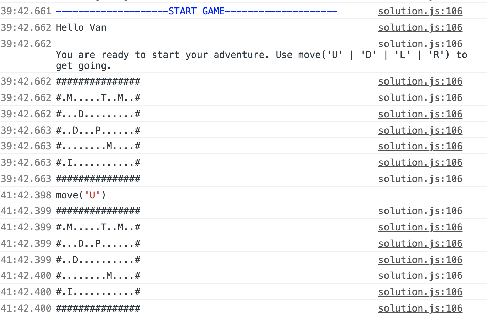
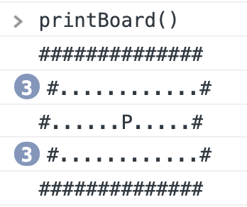
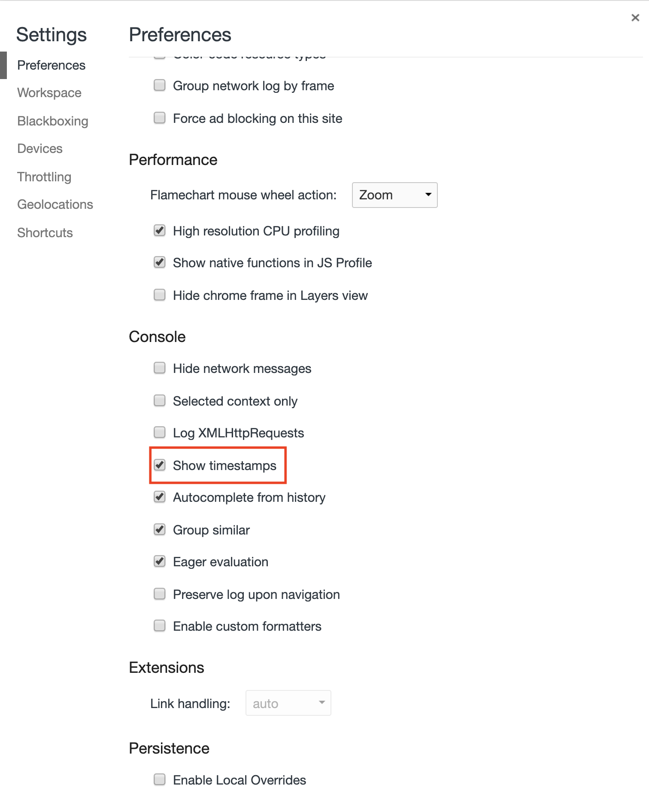

# Javascript project

The goal of this project is to create a console based game in which you are an adventurer on a board game.  
The adventurer can move in 4 directions (Up, Down, Left, Right) and interact with different entities (Monster, Tradesman, Item, Dungeon).

# Resources

Be sure to check the images for more information on the different features of the game

# Grading rubrics

Each of the following grading rubric will be evaluated (PASS or FAIL)

Setup player is functional

- printSectionTitle
- createPlayer
  - Creates a player object with the specified properties (name, level, items)
  - Creates an array of cloned items for the items property
    - items array has item objects with the appropriate properties
    - clone
    - assertEqual (this is a helper function to check if clone works as intended, not necessary for the game itself)
    - cloneArray

Setup board is functional

- initBoard
  - createBoard
    - Creates the board with specified number of rows and columns
    - First and last row & first and last column are wall entities
    - The rest is grass entities
  - placePlayer
    - Places player object in the middle of the board
- printBoard
- create functions
  - Creates the entities with correct properties (based on README) and values specified in parameters
    - Items must be cloned (so as to not modify the original items array)
  - createMonster
  - createItem
  - createTradesman
  - createDungeon
- updateBoard
  - Set the board entity at the entity position

Game core features

- move
  - Player can move in the 4 directions specified
  - Player cannot move past walls
  - When player moves, the entity that was there (e.g. grass) shows up again
  - If player encounters an entity (monster, item, tradesman, dungeon) a message appears to print which entity was encountered (e.g. 'Found the tradesman!')
- Player can pickup an item
  - When an item is picked up, a grass entity replaces it
- Player can win the game
  - Move to unlocked dungeon with princess triggers printSectionTitle with 'GAME OVER' message

Game battle feature

- Player can fight monsters
  - Encountering a monster triggers 2 setInterval
    - Player attack: setInterval using the speed property of the player as the interval time, damages the enemy by the value of the player's attack property
    - Monster attack: setInterval using the speed property of the monster as the interval time, damages the player by the value of the monster's attack property
  - Player or monster can die if hp reaches 0
    - HP cannot go under 0
    - triggers printSectionTitle with 'GAME OVER' message if player dies
    - replace monster with grass entity if defeated
  - Player gains exp points for defeating monsters
    - Player can level up if enough exp is earned.
  - Player can obtain monster items when defeated

Game additional features

- Player can buy items from tradesman
  - Removes gold from player by item value
  - Removes the item bought from tradesman items
  - Adds item bought to player items property
- Player can sell items to tradesman
  - Adds gold to player
  - Removes the item sold from player items
  - Adds item sold to tradesman items property
- Dungeon
  - Player receives dungeon items and gold when there is no princess

Game extra features

- useItem
  - Can use potions, bombs
  - Can use key to unlock locked dungeon
- useSkill
  - Cooldown decreases every 100ms (e.g. 10000 cooldown, every 100ms cooldown value decreases by 100. At 0, skill is useable again)

# Game rules

## Entities

Entities are the board game objects that are either simple static elements such as walls & grass or entities like monsters, the tradesman, the player.

All entities have at least 2 properties: a type (string representing entity type) and a position (object representing board position) property.  
These are the different types:

- player
- item
- monster
- tradesman
- dungeon
- grass (symbol is '.')
- wall (symbol is '#')

A position object has 2 properties:

- row: a number representing the index of the board row
- column: a number representing the index of the board column

### Player

The player has the following properties (parentheses has type)

- name (string)
- level (number)
- items (array of objects)
- skills (array of objects - will have 2 skill objects: confuse and steal)
- attack (number)
- speed (number)
- hp (number)
- gold (number - 0 to start. Can get gold by selling items to the tradesman)
- exp (number - 0 to start. Experience points, increase when slaying monsters)
- type (string - 'player')
- position (object - can be left out and set when needed)
- getMaxHp (function - a method that returns max hp. Value is level \* 100, e.g. level 2 -> 200 max hp)
- levelUp (function - a method to update the level and the different properties affected by a level change. Level up happens when exp >= [player level * 20])
- getExpToLevel (function - a method returning exp required to level. Value is level \* 20, e.g. level 2 -> 40exp required)

When leveling up, exp must be decreased by the amount used to level up, e.g. exp required to level up = 100. current exp = 120  
-> levelUp is called, incrementing by 1 the level and updating exp to exp = 120 - 100 = 20

### Player level rules

The level of the player impacts certain properties of the player.

- hp: max is level \* 100 (e.g. level 1 -> max is 100hp)
- speed: 3000 / level (as level increases, speed gets smaller and thus faster. Speed is in ms, 0 would be instant attack)
- attack: level \* 10 (increases with level)

### Player skills

Skills have the following properties

- name (string)
- requiredLevel (number - the skill should not be useable if player level is lower)
- cooldown (number - initial value is 0 meaning it's useable, over 0 means we have to wait. This gets updated to the cooldown value when skill is used and gradually decreases until it's back to 0)
- use (function - takes a target / entity as a parameter and uses the skill on it)

2 skills to implement: confuse and steal  
confuse:

- required level is 1
- cooldown is 10000
- use: expects a target as parameter and reverses the name of the target entity as well as dealing [player level \* 25] damage (e.g. level 1 -> deals 25hp)

steal:

- required level is 3
- cooldown is 25000
- use: expects a target as parameter and steals all items of rarity 1 or lower (i.e. unusual or common). Stolen items should be added to the player and removed from the target entity.

### Items

Items have the following properties

- name (string - Use the rarity name + type. Example for type 'potion' and rarity 0 -> Common potion)
- type (string - type of item)
- value (number)
- rarity (number - index of the corresponding rarity in RARITY_LIST, e.g. 0 is 'Common')
- use (function - expects a target as parameter to specify on which target to use the item)

3 types of objects to implement:  
potion:

- name: 'Common potion' (if rarity 0)
- type: 'potion'
- value: 5
- rarity: 0
- use: restores 25hp to the specified target

bomb:

- name: 'Common bomb' (if rarity 0)
- type: 'bomb'
- value: 7
- rarity: 0
- use: deals 50hp damage to the specified target

key:

- name: 'Epic key'
- type: 'key'
- value: 150
- rarity: 3
- use: Unlocks the door to a dungeon

You can tweak the properties and make more item objects

Bonus:  
Potion with rarity 3 restores 100% hp (sets hp back to max hp)  
Bomb with rarity 3 deals 90% damage of hp

### Monsters

Monsters have the following properties (parentheses has type and initial value)

- name (string - random from list of monster names)
- level (number - specified in parameters)
- hp (number - max is level \* 100)
- attack (number - level \* 10)
- speed (number - 6000 / level)
- items (array of objects - may be empty or not depending on parameters)
- position (object - specified in parameters)
- type (string - 'monster')
- getMaxHp (function - a method that returns max hp. Value is level \* 100, e.g. level 2 -> 200 max hp)
- getExp (function - returns exp received for defeating monster. Value is level \* 10 e.g. level 2 -> 20 exp points received)??

### Tradesman

Tradesman has the following properties (parentheses has type and initial value)

- name (string - can be anything)
- hp (number - Infinity)
- items (array of objects - may be empty or not depending on parameters)
- position (object - specified in parameters)
- type (string - 'tradesman')
- getMaxHp (function - a method that returns max hp. For tradesman it's Infinity)

When the player and tradesman have the same position it is possible to buy an item from the tradesman or sell an item. Each item has a value property which is the amount of gold necessary to buy the item. It's also the amount of gold a player receives when selling an item. Higher rarity items should have higher value.

### Dungeon

Dungeon has the following properties (parentheses has type and initial value)

- isLocked (boolean)
- hasPrincess (boolean)
- items (array of objects)
- gold (number)
- position (object - specified in parameters)
- type (string - 'dungeon')

If a dungeon has no princess, player receives items and gold in that dungeon

### Battle rules

When a player and a monster have the same position, each starts to attack indefinitely at an interval specified by their speed property until either the player moves to a different position or one of the entities hp goes to 0. The damage dealt is specified by the attack property.

## Useful functions

- Math.floor
- Math.random
- setInterval
- setTimeout
- clearInterval
- clearTimeout
- Object.keys
- Object.values

All the array methods

## Notes

Use the debugger when you're not sure what's going on. You can just write `debugger;` where you think there is a problem and reload the page, it will stop at the debugger.  
From there you can go line by line and see where the problem is.  
Helpful resource: https://javascript.info/debugging-chrome

Use timestamps to avoid having the web browser collapsing your console output:  
Bad

Good

